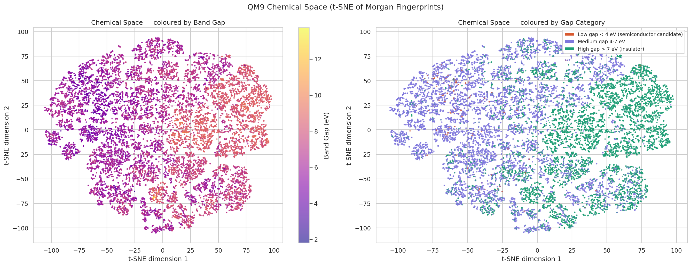
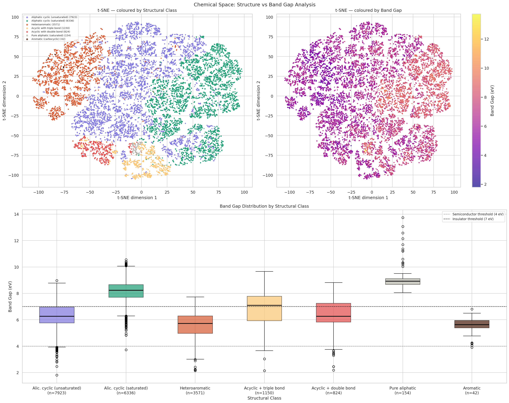
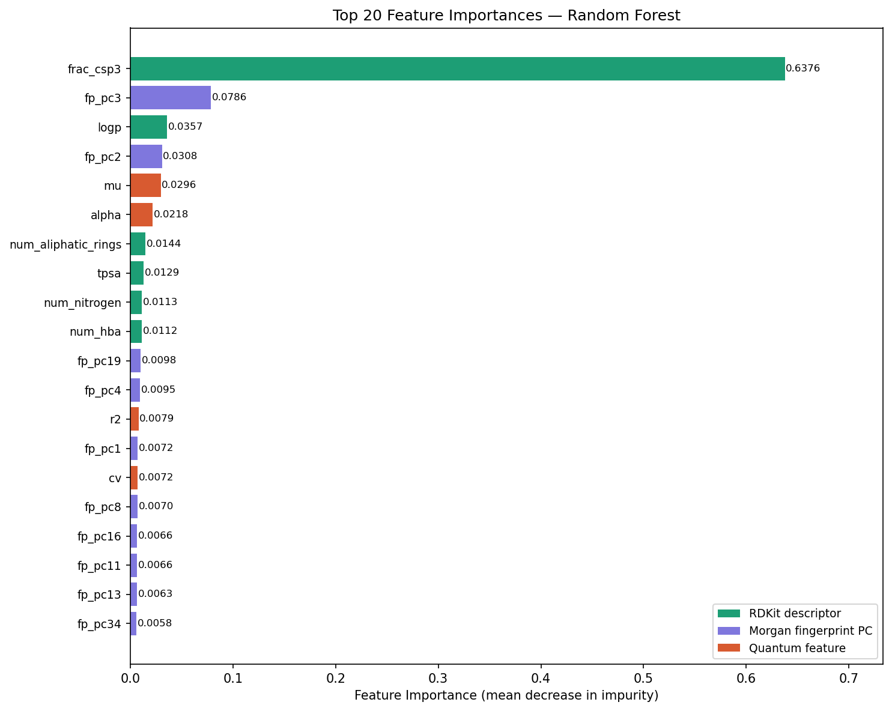
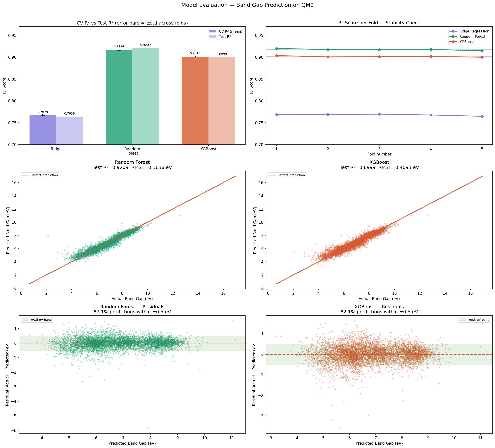

# Materials Band Gap Prediction — QM9 Dataset


> Project 2 of 6 — ML Portfolio | Predicting HOMO-LUMO band gap of organic
> molecules from molecular structure using cheminformatics and machine learning.

---

## Problem Statement

Can we predict the band gap (HOMO-LUMO gap) of a molecule from its 2D
structure alone — without running expensive quantum chemistry calculations?

The HOMO-LUMO gap determines whether a molecule is a conductor,
semiconductor, or insulator — a critical property for designing solar
cells, LEDs, and organic transistors. Computing it via Density Functional
Theory (DFT) takes minutes to hours per molecule. An accurate ML model
reduces this to milliseconds, enabling screening of millions of candidates.

---

## Dataset

**QM9** — Quantum Machine 9 (Ramakrishnan et al., Scientific Data 2014)

| Property | Value |
|---|---|
| Source | quantum-machine.org |
| Molecules | 133,885 small organic molecules |
| Heavy atoms | Up to 9 (C, H, O, N, F) |
| Properties | 19 quantum mechanical properties computed by DFT (B3LYP/6-31G) |
| Target | HOMO-LUMO gap (gap) in eV |
| Missing values | None |

**Unit validation:** All energies stored in Hartree atomic units.
Verified against benzene experimental reference (0.2503 Hartree = 6.811 eV,
experimental ~6.0 eV — consistent with known B3LYP overestimation of ~13%).

---

## Project Pipeline
QM9 Dataset (133,885 molecules)
↓

Exploratory Data Analysis

Band gap distribution
Unit validation (Hartree → eV)
↓


Chemical Space Visualisation

Morgan fingerprints → PCA (2048→50) → t-SNE (50→2)
Structural classification (7 families)
Band gap distribution per class
↓


Chemically Motivated Filtering

Element check (C,H,O,N,F only): 0 removed
Valence sanity check: 0 removed
Complexity filter (≥3 heavy atoms): 8 removed
PAINS filter: NOT applied (drug-discovery specific,
irrelevant for materials science — justified by investigation)
Final dataset: 133,877 molecules (99.99% retention)
↓


Feature Engineering (69 features → 31 selected)

15 RDKit molecular descriptors
50 Morgan fingerprint PCA components
4 QM9 quantum features (mu, alpha, r2, cv)
Feature selection: |r| ≥ 0.05 + chemical redundancy removal
↓


Model Training (5-Fold Cross Validation)

Ridge Regression (linear baseline)
Random Forest
XGBoost
SVR (excluded — O(n²), infeasible on 133k molecules)
↓


Evaluation and Interpretation

Benchmark comparison with published literature
Feature importance analysis
---

## Key Findings

### Chemical Space Analysis

Seven structural families identified in QM9:

| Class | Count | Mean Gap (eV) |
|---|---|---|
| Aliphatic cyclic (unsaturated) | 39.6% | ~6.7 |
| Aliphatic cyclic (saturated) | 31.7% | ~8.1 |
| Heteroaromatic | 17.9% | ~6.0 (lowest) |
| Acyclic with triple bond | 5.8% | ~7.2 |
| Acyclic with double bond | 4.1% | ~6.7 |
| Pure aliphatic (saturated) | 0.8% | ~9.0 (highest) |
| Aromatic (carbocyclic) | 0.2% | ~6.0 |

**Key insight:** More electron delocalisation → smaller band gap.
Heteroaromatic molecules cluster in a distinct region of chemical space
with systematically lower gaps — confirmed by t-SNE visualisation.

### Filtering Decision

The PAINS filter flagged 600 molecules including 1,2-diketones,
enone-ynes, and cyano-containing molecules. After investigation:

- **Cyano groups (C#N):** Present in 16,653 molecules (12.4% of dataset).
  Mean gap (6.92 eV) nearly identical to non-cyano molecules (6.82 eV).
  Used in real semiconductors (TCNQ, PC61BM). **Kept.**
- **1,2-diketones and enone-ynes:** Known building blocks in organic
  photovoltaics and nonlinear optical materials. **Kept.**
- PAINS was designed for drug-discovery biological assays.
  Applying it to materials science has no scientific justification.

**Only 8 trivially simple molecules removed** (CH4, NH3, H2O, C2H2,
CHN, CH2O, C2H6, CH4O) — molecules with <3 heavy atoms with no
semiconductor application.

### Feature Importance

`frac_csp3` (fraction of sp3 carbons) accounts for **63.8% of Random
Forest importance** — single most powerful predictor. This directly
captures electron delocalisation: sp2/aromatic carbons → small gap,
sp3 carbons → large gap. The model independently rediscovered the
fundamental principle of molecular electronics from data alone.

---

## Model Results

### 5-Fold Cross Validation + Hold-out Test Set

| Model | CV R² (±std) | CV RMSE | Test R² | Test RMSE | Test MAE |
|---|---|---|---|---|---|
| Ridge Regression | 0.768 ± 0.002 | 0.623 eV | 0.764 | 0.629 eV | 0.487 eV |
| **Random Forest** | **0.917 ± 0.002** | **0.372 eV** | **0.921** | **0.364 eV** | **0.258 eV** |
| XGBoost | 0.901 ± 0.001 | 0.406 eV | 0.900 | 0.409 eV | 0.303 eV |
| SVR | N/A | N/A | N/A | N/A | N/A |

**SVR excluded:** O(n²) computational complexity — infeasible on
133,877 molecules. Suitable for datasets <10,000 samples.

**Best model: Random Forest**
- Test R² = 0.921 — explains 92.1% of band gap variance
- RMSE = 0.364 eV — average prediction error
- MAE = 0.258 eV — 87.1% of predictions within ±0.5 eV
- Stable across all 5 CV folds (std = 0.002)

### Comparison with Published Literature

| Model | Features | MAE (eV) | Source |
|---|---|---|---|
| Our Random Forest | 2D descriptors + fingerprints | **0.258** | This work |
| Published RF | Morgan fingerprints | 0.269 ± 0.001 | Wang et al. 2022 |
| Published RF | RDKit 290 descriptors | ~0.17–0.26 | Katayama Group |
| SchNet | 3D atomic coordinates | 0.076 | Schütt et al. 2017 |
| DimeNet | 3D + bond angles | 0.049 | Gasteiger et al. 2020 |

**Our 2D Random Forest matches published RF benchmarks** (0.258 vs
0.269 eV MAE). The gap to 3D models is expected — HOMO-LUMO gap is
a 3D quantum mechanical property that 2D fingerprints approximate
but cannot fully capture.

---

## Notebooks

| Notebook | Content |
|---|---|
| `01_eda_chemical_space.ipynb` | EDA, unit validation, t-SNE/PCA visualisation, structural classification |
| `02_filtering_features.ipynb` | Chemical filters, feature engineering, feature selection |
| `03_ml_models_2d.ipynb` | Model training (5-fold CV), evaluation, feature importance, benchmark comparison |

---

## Visualisations

### Chemical Space (t-SNE)


### Structural Class Analysis


### Feature Importance


### Model Evaluation


---

## Roadmap — Next Steps

This project is actively being developed. Planned improvements:

| Phase | Method | Expected MAE | Status |
|---|---|---|---|
| ✅ Current | 15 RDKit + Morgan PCA + 4 quantum | 0.258 eV | Done |
| 🔄 Phase 2 | Mordred full descriptors (1,344) | ~0.18-0.22 eV | Planned |
| 🔄 Phase 3 | Class-specific models per structural family | ~0.10-0.15 eV | Planned |
| 🔄 Phase 4 | 3D conformer descriptors (RDKit ETKDG) | ~0.10-0.13 eV | Planned |
| 🔄 Phase 5 | 2D Graph Neural Network (GCN/GIN) | ~0.05-0.10 eV | Planned |
| 🔄 Phase 6 | SchNet 3D GNN (3D coordinates) | ~0.076 eV | Planned |

---

## How to Run

**1. Clone the repo**
```bash
git clone https://github.com/yourusername/02-materials-bandgap-prediction.git
cd 02-materials-bandgap-prediction
```

**2. Set up environment**
```bash
conda env create -f environment.yml
conda activate ml_practice
```

**3. Download QM9 dataset**

Run Cell 2 in any notebook — downloads automatically from AWS S3.

**4. Run notebooks in order**

Open Jupyter and run notebooks 01 → 02 → 03 in sequence.
Each notebook saves intermediate files to `data/` so subsequent
notebooks can reload without recomputation.

---

## Scientific Decisions Documented

| Decision | Reasoning |
|---|---|
| PAINS filter rejected | Designed for drug discovery — irrelevant for materials |
| Cyano groups kept | 12.4% of dataset, used in real semiconductors |
| num_rings removed | Merged aromatic + aliphatic effects — chemically misleading |
| num_bonds removed | Size proxy redundant with mol_weight |
| SVR excluded | O(n²) — computationally infeasible at this scale |
| Hartree → eV conversion | Verified against benzene experimental reference |

---

## Environment
Python 3.11
RDKit 2024
scikit-learn 1.3
XGBoost 2.0
pandas, numpy, matplotlib, seaborn, tqdm
---

## References

- Ramakrishnan et al. (2014). Quantum chemistry structures and properties
  of 134 kilo molecules. *Scientific Data* 1, 140022.
- Wang et al. (2022). Molecular Contrastive Learning of Representations
  via Graph Neural Networks. *Nature Machine Intelligence*.
- Schütt et al. (2017). SchNet: A continuous-filter convolutional neural
  network for modeling quantum interactions. *NeurIPS*.
- Mazouin et al. (2022). Selected machine learning of HOMO-LUMO gaps
  with improved data-efficiency. *Materials Advances*.

---

*Part of my ML learning portfolio — 6 projects from regression to
deep learning, each building on the last.*
